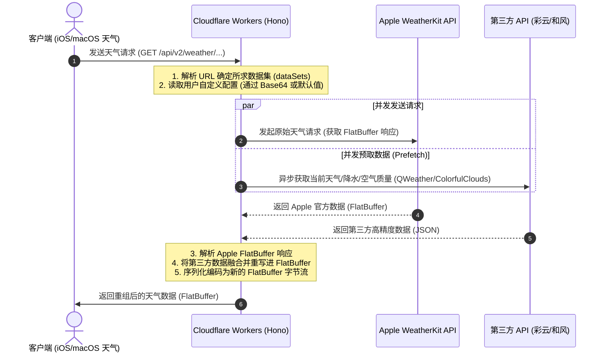

# 🌤 WeatherKit-Proxy 架构设计与实现原理

本项目是对 [NSRingo/WeatherKit](https://github.com/NSRingo/WeatherKit) 的重构与改造，旨在提供一个超轻量、免构建、零本地脚本依赖的远程代理服务，运行于 Cloudflare Workers 边缘计算平台。

---

## 🏗 整体架构

本项目采用 **边缘代理拦截模式**。它作为客户端（iOS / macOS 系统的原生天气应用）与 Apple 官方 WeatherKit 服务器之间的中间件。其核心目标是在边缘节点拦截天气请求，并实时融合、修正来自第三方气象服务（如彩云天气、和风天气）的高精度天气及空气质量数据，最终以 Apple 兼容的格式返回。

### 核心设计原则
* **远程代理，零本地重写**：完全移除客户端本地 JS 重写逻辑，降低客户端 CPU 开销，使规则更新即时生效。
* **免构建（Zero-Build）**：源码符合原生 ES Modules 规范，不需要打包构建（Webpack 等）即可直接作为原生 Worker 部署运行。
* **极速响应**：利用 Cloudflare 边缘计算的并行计算能力，在请求被 Apple 处理的同时**并发预取**第三方数据。

---

## 🔄 请求生命周期与流程

以下是客户端发起一次天气查询请求到最终响应的完整生命周期：

1. **路由与配置解析**
   * 请求到达 [Hono.js](file:///Users/meme/Developer/weatherkit-proxy/src/Hono.js)。如果请求路径携带了配置前缀 `/p/:configBase64`，系统会解析 Base64 编码的个性化配置参数，并与 URL Query 参数合并。
   * [HonoWorkerAdapter.mjs](file:///Users/meme/Developer/weatherkit-proxy/src/class/HonoWorkerAdapter.mjs) 将 Hono 请求转换为内部标准化的请求格式。
2. **并发预取 (Prefetch)**
   * 系统通过 [parseWeatherKitURL.mjs](file:///Users/meme/Developer/weatherkit-proxy/src/function/parseWeatherKitURL.mjs) 提取请求的目标纬度、经度、国家码和请求的数据集（`dataSets`，如 `currentWeather`、`forecastNextHour`、`airQuality`）。
   * 根据用户的服务提供商配置（如选择彩云天气或和风天气），在向 Apple 官方接口发送请求的同时，**异步且并发**地向第三方 API 获取降水、当前天气或 AQI 信息。通过 `Promise.all` 极大减少总响应耗时。
3. **数据合并与重写**
   * 拦截到 Apple 官方的 FlatBuffer 字节流响应后，通过 [WeatherKit2.mjs](file:///Users/meme/Developer/weatherkit-proxy/src/class/WeatherKit2.mjs) **按需解码**：仅解析请求中可被注入的 root 产品（`airQuality`、`currentWeather`、`forecastDaily`、`forecastHourly`、`forecastNextHour`），其余产品保持为不透明字节。
   * 根据配置，使用 `InjectAirQuality`、`InjectCurrentWeather`、`InjectForecastNextHour` 等方法将预取的第三方高精度数据注入并改写对应的字段。
   * 仅对**实际发生替换/改动的产品**重编码对应槽位，其余未触及的 root 产品（含 iOS 27 等新 schema 引入、本代理不识别的产品）经 [flatBufferRootOverlay.mjs](file:///Users/meme/Developer/weatherkit-proxy/src/function/flatBufferRootOverlay.mjs) 以 copy-on-write 方式原样保留，避免在 decode/encode 往返中丢失；若无任何改动则直接透传 Apple 原始字节。

---

## 📁 关键目录与模块划分

* **[src/Hono.js](file:///Users/meme/Developer/weatherkit-proxy/src/Hono.js)**
  系统的入口文件与路由分发器。定义了配置下发接口 `/conf/:filename`，可视化控制面板首页 `/`，以及天气 API 代理的并发预取逻辑。
* **[src/class/](file:///Users/meme/Developer/weatherkit-proxy/src/class/)**
  包含所有的核心业务类和第三方 API 适配层：
  * **[HonoWorkerAdapter.mjs](file:///Users/meme/Developer/weatherkit-proxy/src/class/HonoWorkerAdapter.mjs)**: Hono 运行时适配层，统合请求与响应回写。
  * **[WeatherKit2.mjs](file:///Users/meme/Developer/weatherkit-proxy/src/class/WeatherKit2.mjs)**: 处理 Apple 专有的天气数据 FlatBuffer 编解码。
  * **[ColorfulClouds.mjs](file:///Users/meme/Developer/weatherkit-proxy/src/class/ColorfulClouds.mjs) / [QWeather.mjs](file:///Users/meme/Developer/weatherkit-proxy/src/class/QWeather.mjs)**: 分别对接彩云天气与和风天气 API，对数据字段进行标准化清洗。
  * **[AirQuality.mjs](file:///Users/meme/Developer/weatherkit-proxy/src/class/AirQuality.mjs) / [AirQualityScale.mjs](file:///Users/meme/Developer/weatherkit-proxy/src/class/AirQualityScale.mjs)**: 国标 AQI 的计算与展示规则，以及针对 `/api/v1/airQualityScale` 接口（Apple 在国内部分地区返回 404）在边缘端进行本地构建返回 200 的能力。
* **[src/process/Response.mjs](file:///Users/meme/Developer/weatherkit-proxy/src/process/Response.mjs)**
  天气拦截响应的核心业务流，统筹控制所有数据注入逻辑（`InjectCurrentWeather`、`InjectForecastDaily`、`InjectForecastHourly`、`InjectForecastNextHour`、`InjectAirQuality`）。
* **[src/function/](file:///Users/meme/Developer/weatherkit-proxy/src/function/)**
  * **[indexPage.mjs](file:///Users/meme/Developer/weatherkit-proxy/src/function/indexPage.mjs)**: 炫酷的控制面板页面（Web UI），通过无状态的纯前端 Base64 保存参数，安全并方便导入各主流网络工具。
  * **[configs.mjs](file:///Users/meme/Developer/weatherkit-proxy/src/function/configs.mjs)**: 包含各大网络客户端（Surge, Loon, Stash, Shadowrocket 等）的配置模版，自动在请求下载时替换域名为当前 Workers 地址。

---

## ⚡ 性能优化机制

为保障代理过程不对用户的日常天气刷新产生肉眼可见的影响，项目采取了以下性能保障手段：
1. **多路并发查询**：将 Apple API 的 HTTPS 请求与第三方 API 的查询通过 `Promise.all` 包装并行发起，由于 CF Workers 具备极高的网络带宽和并发处理能力，整体请求耗时基本等同于 Apple 与第三方中较慢的一方。
2. **极简工具方法**：如 [src/utils/Lodash.mjs](file:///Users/meme/Developer/weatherkit-proxy/src/utils/Lodash.mjs) 仅实现了项目所需的少数工具函数（如 `set`、`get`、`merge`），避免引入重型外部库，保证冷启动和内存开销处于极低水平。
3. **缓存降级机制**：所有网络接口调用都进行了 `catch` 异常防护，一旦第三方源崩溃或超时，将静默降级为 Apple 官方天气数据，保证客户端天气功能的基本可用性。
